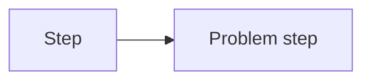
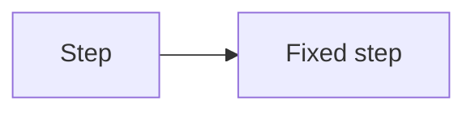

# Code Review — 4-Eyes Principle

Act as the **second pair of eyes** on the code. Your job is not to rubber-stamp it but to catch what the original developer likely missed: hidden logic errors, SOLID violations, unnecessary complexity, duplicated patterns, or speculative over-engineering. Always keep the **business context** in mind — a beautiful refactor that breaks a critical flow is worse than ugly code that works.

---

## Step 1 — Clarify scope

If the user hasn't specified a target, ask:

> "Which file or directory should I review? Any specific business context I should know?"

If they did specify a target, proceed immediately.

---

## Step 2 — Analyse the code

Read all target files. Evaluate against these lenses:

| Lens | What to look for |
|---|---|
| **4-Eyes** | Logic errors, off-by-one bugs, unchecked nulls/errors, edge cases, security holes the author likely didn't notice |
| **SOLID** | SRP violations (class/function doing too much), rigid inheritance, leaky abstractions, tight coupling |
| **DRY** | Copy-pasted blocks, parallel class hierarchies, duplicated validation logic |
| **YAGNI** | Dead code, unused flags, "future-proof" abstractions with no current consumer |
| **KISS** | Nested ternaries, over-abstracted utilities, complex state machines where a simple condition suffices |

Think like a senior reviewer who cares about the product shipping safely, not just ticking boxes.

---

## Step 3 — Write the report

Use **exactly** this template. Fill every section; do not skip any.

~~~markdown
# Code Review Report

**Date:** [YYMMDD]
**Reviewer:** Leo – AI + 4-Eyes
**Scope:** [file or directory path(s)]

---

## Code Score

**Overall: [X] / 100**

> _Brief one-liner rationale for the score._

---

## Business Impact Assessment

_2–4 sentences. How does the current code state affect the product? Think: stability risk, performance
bottlenecks, maintainability cost, potential data loss or incorrect behaviour in production._

---

## Actionable Findings

### 🔴 CRITICAL — Must fix before shipping

| # | Location | Issue | Recommendation |
|---|---|---|---|
| C1 | `ClassName.methodName` | … | … |

### 🟡 WARNING — Tech debt / design issues

| # | Location | Issue | Recommendation |
|---|---|---|---|
| W1 | `ClassName.methodName` | … | … |

### 🔵 LOW — Nice-to-have improvements

| # | Location | Issue | Recommendation |
|---|---|---|---|
| L1 | `ClassName.methodName` | … | … |

---

## Finding Details

For each finding above, add a subsection. For architectural / flow issues include a Before/After:

### [C1 / W1 / L1] — Short title

**Class / Function:** `FullyQualified.name`

**Detail:** _Explanation of the problem and why it matters._

**Before flow → Optimised flow** _(omit if not a flow issue)_



→



---

## Principles Summary

| Principle | Status | Notes |
|---|---|---|
| SOLID | ✅ Pass / ⚠️ Improve / ❌ Fail | … |
| DRY | ✅ Pass / ⚠️ Improve / ❌ Fail | … |
| YAGNI | ✅ Pass / ⚠️ Improve / ❌ Fail | … |
| KISS | ✅ Pass / ⚠️ Improve / ❌ Fail | … |
~~~

---

## Step 4 — Save the report

Determine the output path:

1. Format today's date as `YYMMDD` (e.g. `260414` for 14 Apr 2026).
2. Base path: `docs/code-review/Code-Review-[YYMMDD].md`
3. If that file already exists, append `-v2`, `-v3`, etc.
4. Create the `docs/code-review/` directory if it doesn't exist (use Bash: `mkdir -p docs/code-review`).
5. Write the report using the Write tool.

> Save relative to the **project root** (i.e., the workspace folder the user has open), not the session temp directory.

---

## Step 5 — Notify the user

After saving, reply in chat with a concise summary:

```
✅ Review complete — saved to docs/code-review/Code-Review-[YYMMDD].md

📊 Score: [X]/100
🔴 Critical: [N] issue(s)
🟡 Warning: [N] issue(s)
🔵 Low: [N] issue(s)

💼 Business Impact: [one sentence]
```

Then offer to walk through any specific finding if the user wants.

---

## Tips for a great review

- **Be specific.** Name the exact class, function, and line range. Vague feedback wastes the developer's time.
- **Explain the risk, not just the rule.** "This violates SRP" is less useful than "This class mixes HTTP parsing and DB writes — a schema change will force you to touch HTTP logic."
- **Prioritise ruthlessly.** A score of 60/100 with 2 critical issues is more actionable than 15 low-severity nits.
- **Acknowledge what's good.** If the architecture is solid, say so. It helps the developer understand what patterns to keep.
