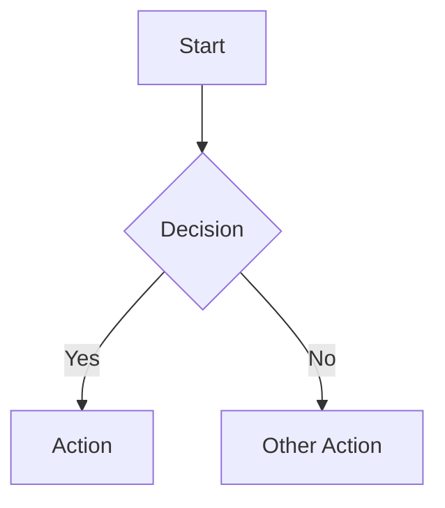
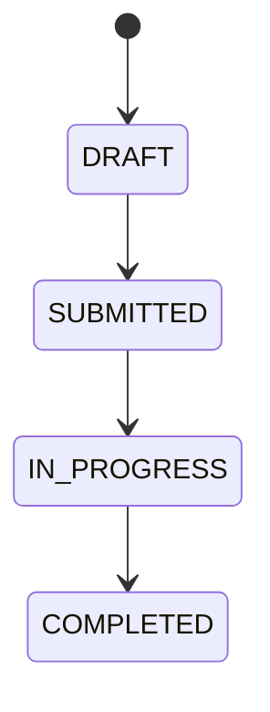
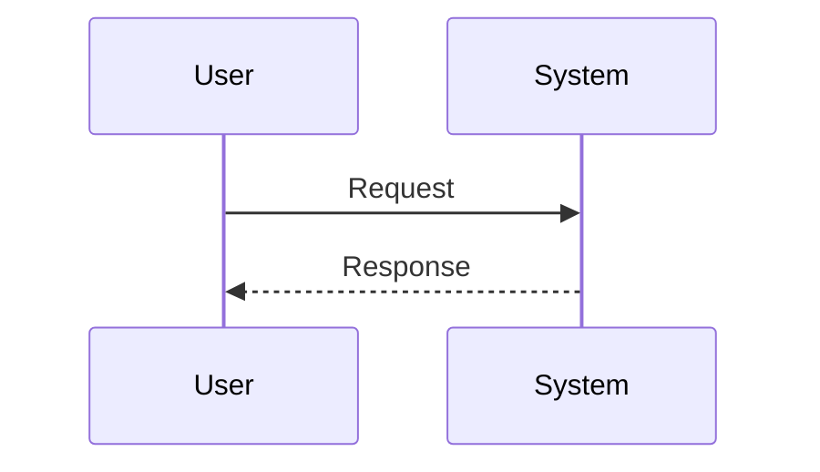

# Documentation Skill

## Overview

This skill covers technical writing best practices, documentation organization, and maintenance strategies for enterprise software projects.

## Protocols

| Protocol | When | Reference |
|----------|------|-----------|
| Code-to-Docs Sync | After code changes | `resources/code-sync-protocol.md` |
| Business Docs | Writing process flows, user guides | `resources/business-docs-guide.md` |
| Accuracy Protocol | Before any documentation | `resources/accuracy-protocol.md` |

---

## Documentation Categories

| Category | Audience | Purpose | Code Samples? |
|----------|----------|---------|---------------|
| **Product Docs** | End Users | Use the product | ❌ No |
| **Business Docs** | BA Team | Understand processes | ❌ No |
| **Technical Docs** | Developers | Build & maintain | ✅ Yes |
| **Project Docs** | Internal Team | Track progress | ❌ No |
| **Release Docs** | All | Track changes | Minimal |

---

## Mandatory Directory Structure

**ALL projects MUST use this structure:**

```
docs/
├── README.md               # Main documentation hub (required)
│
├── product/                # End-user documentation
│   ├── README.md           # User docs index
│   ├── getting-started.md
│   ├── user-manual/
│   └── admin-guide/
│
├── business/               # BA team (NO code)
│   ├── README.md           # Business docs index
│   ├── process-flows/      # Mermaid diagrams
│   ├── data-dictionary.md
│   └── requirements/
│
├── technical/              # Developer documentation
│   ├── README.md           # Technical docs index
│   ├── architecture/       # System design
│   ├── implementation/     # How-to guides
│   ├── reference/          # API docs
│   └── testing/            # Test reports
│
├── project/                # Internal team
│   ├── README.md           # Project docs index
│   ├── roadmap.md
│   ├── backlog.md
│   ├── sprints/
│   └── decisions/          # ADRs
│
├── releases/               # Changelog
│   └── README.md
│
└── archive/                # Historical reference
```

> **Rule:** When creating new docs, place them in the correct category based on audience.

## Document Structure Standards

### Required Header

Every document MUST have:

```markdown
# Document Title

> **Owner:** [Role] | **Last Updated:** YYYY-MM-DD | **Status:** Active/Draft/Archived
```

### Recommended Sections

1. **Overview** - What is this document about?
2. **Quick Reference** - Key information at a glance
3. **Details** - Full content
4. **Related Documents** - Links to related docs

---

## Writing Guidelines

### For Technical Docs
- Include code samples with syntax highlighting
- Use Mermaid diagrams for architecture
- Document the "why" not just the "what"
- Keep code samples minimal and focused

### For Business Docs (BA Team)
- NO code samples ever
- Use process flow diagrams
- Use plain language
- Use tables for matrices and comparisons
- Include swimlane diagrams for cross-functional processes

### For Product Docs (Users)
- Use friendly, non-technical language
- Include step-by-step instructions
- Use screenshots where helpful
- Include FAQ section

---

## Process Flow Standards

### Mermaid Flowchart (Technical)


### State Diagram (Status Flows)


### Sequence Diagram (Interactions)


---

## Documentation Maintenance

### When to Update Docs

| Trigger | Required Updates |
|---------|------------------|
| Code change affecting behavior | Technical + Product docs |
| New feature | All relevant categories |
| Bug fix | CHANGELOG only |
| Architecture change | Technical docs |
| Process change | Business docs |

### Quarterly Review Checklist

- [ ] All "Last Updated" dates current
- [ ] No broken internal links
- [ ] Archived outdated content
- [ ] Verified code samples still work
- [ ] Screenshots current

---

## ADR (Architectural Decision Record) Format

```markdown
# ADR-XXX: Decision Title

## Status
✅ Accepted | 🔄 Amended | ❌ Superseded

## Context
Why was this decision needed?

## Decision
What was decided?

## Consequences
- ✅ Positive outcome
- ❌ Negative tradeoff
```

---

## Best Practices

1. **Docs-as-Code**: Documentation lives in Git, reviewed in PRs
2. **Single Source of Truth**: One document per topic
3. **Keep It Current**: Update docs with code changes
4. **Right Audience**: Write for the reader, not yourself
5. **Minimal Viable Docs**: Document what's needed, no more
