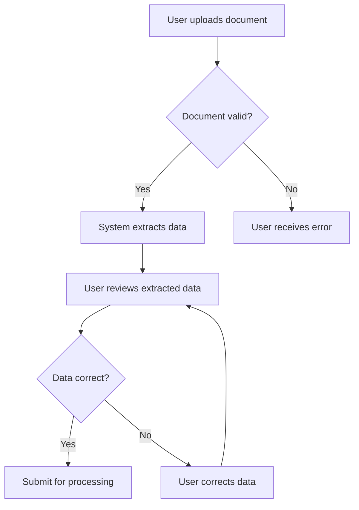
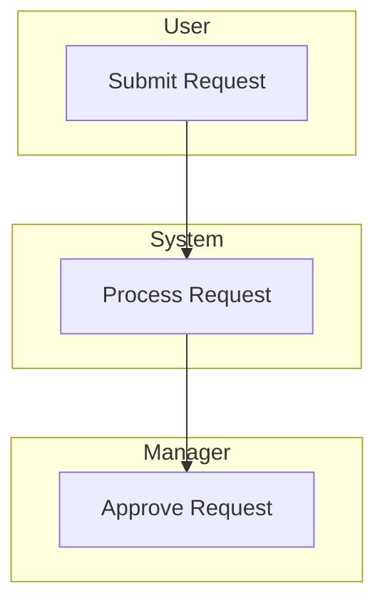
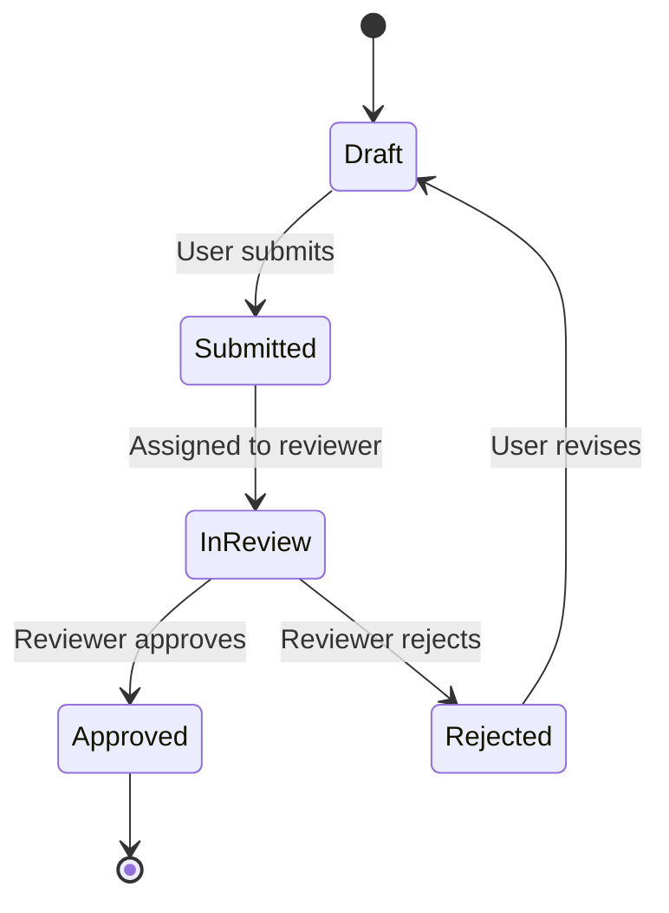

# Business Documentation Guide

Business documentation is for **non-technical stakeholders**. Keep it code-free.

## ❌ Golden Rule: NO CODE

Business docs must contain:
- NO code snippets
- NO SQL queries
- NO API examples
- NO technical implementation details

## ✅ Use Instead

| Instead of Code | Use This |
|-----------------|----------|
| API request/response | Plain language description |
| SQL query | "The system retrieves matching records" |
| Code logic | Process flow diagram |
| Technical flags | Business terminology |

## Document Types

### 1. Process Flows (`docs/business/process-flows/`)

Use Mermaid diagrams:

**Structure:**
- Title and overview
- Actors involved
- Process flow diagram
- Decision points explained
- Exception handling

### 2. Data Dictionary (`docs/business/data-dictionary.md`)

| Entity | Description | Key Fields |
|--------|-------------|------------|
| Document | An uploaded file requiring processing | Name, Type, Status |
| Extraction | Data extracted from a document | Source, Confidence, Fields |

**Rules:**
- Use business terms, not technical names
- Describe purpose, not implementation
- Include valid values for status fields

### 3. User Guide (`docs/product/user-manual/`)

Structure for each feature:
1. **What it does** — One sentence
2. **When to use it** — Business context
3. **How to use it** — Step-by-step with screenshots
4. **What happens next** — Expected outcome

### 4. Roles & Permissions (`docs/business/roles-permissions.md`)

| Role | Can View | Can Edit | Can Approve | Can Delete |
|------|----------|----------|-------------|------------|
| Viewer | ✅ | ❌ | ❌ | ❌ |
| Editor | ✅ | ✅ | ❌ | ❌ |
| Approver | ✅ | ✅ | ✅ | ❌ |
| Admin | ✅ | ✅ | ✅ | ✅ |

## Mermaid Tips for Business Docs

### Swimlane Diagram (Cross-functional)

### State Diagram (Status Flow)

## Review Checklist

Before publishing business docs:
- [ ] Zero code snippets
- [ ] Plain language throughout
- [ ] Diagrams are clear to non-technical readers
- [ ] Business terms used (not technical jargon)
- [ ] Roles and permissions reflect business reality
