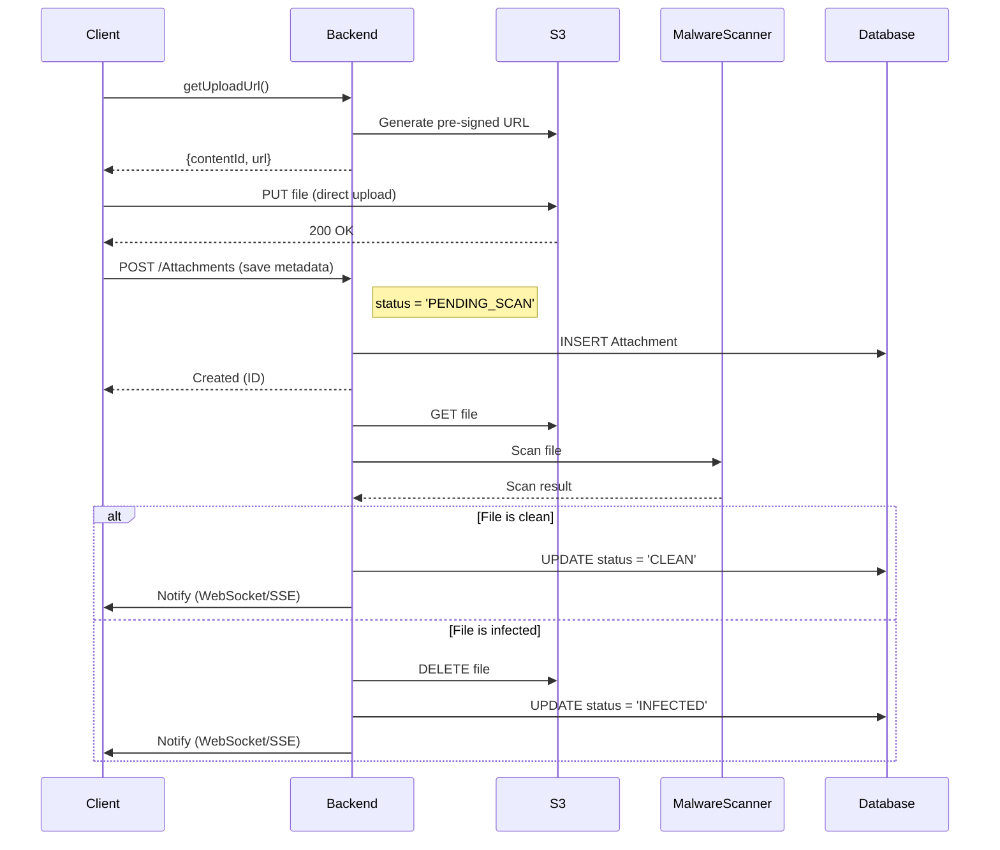

# Malware Scanning Integration with Pre-Signed URLs

> **Important**: You CAN use pre-signed URLs together with SAP Malware Scanning Service by implementing **post-upload scanning**. This document explains how.

---

## Overview

The pre-signed URL pattern allows direct client-to-S3 uploads for performance. Malware scanning can be integrated using a **3-phase approach**:

1. **Upload** - Client uploads directly to S3 (fast)
2. **Scan** - Backend scans the file asynchronously
3. **Validate** - Backend marks file as safe or quarantined

---

## Integration Pattern

### Pattern: Post-Upload Asynchronous Scanning



---

## Extended Data Model

Add scanning status to your Attachments entity:

```cds
type ScanStatus : String enum {
    PENDING_SCAN;  // Just uploaded, not scanned yet
    SCANNING;      // Currently being scanned
    CLEAN;         // Passed scan
    INFECTED;      // Failed scan (quarantined)
    SCAN_ERROR;    // Scan service error
}

entity Attachments : cuid, managed {
    fileName      : String;
    mimeType      : String;
    size          : Integer;
    contentId     : String;
    request       : Association to Requests;
    
    // Malware scanning fields
    scanStatus    : ScanStatus default 'PENDING_SCAN';
    scanDate      : DateTime;
    scanResult    : String;  // Detailed scan result from service
    isAvailable   : Boolean default false;  // Only true when CLEAN
}
```

---

## Implementation

### Step 1: Update AttachmentHandler

```typescript
// srv/handlers/AttachmentHandler.ts

import { cds, SELECT, UPDATE } from '../lib/db.ts';
import { ObjectStoreProvider } from '../lib/object-store.ts';
import { MalwareScannerService } from '../lib/malware-scanner.ts';

export class AttachmentHandler {
    
    /**
     * After file upload, trigger malware scan
     */
    private async afterCreate(req: cds.Request) {
        const attachment = req.data;
        
        // Trigger async scan (don't wait)
        this.scanFile(attachment.ID, attachment.contentId).catch(err => {
            console.error(`[AttachmentHandler] Scan failed for ${attachment.ID}:`, err);
        });
    }

    /**
     * Asynchronous file scanning
     */
    private async scanFile(attachmentID: string, contentId: string): Promise<void> {
        const { Attachments } = this.srv.entities;
        
        try {
            // Update status to SCANNING
            await UPDATE(Attachments, attachmentID).set({
                scanStatus: 'SCANNING'
            });

            // Download file from S3
            const fileStream = await ObjectStoreProvider.getFile(contentId);
            
            // Scan with SAP Malware Scanning Service
            const scanResult = await MalwareScannerService.scan(fileStream, contentId);

            if (scanResult.isClean) {
                // Mark as clean and available
                await UPDATE(Attachments, attachmentID).set({
                    scanStatus: 'CLEAN',
                    scanDate: new Date().toISOString(),
                    scanResult: JSON.stringify(scanResult),
                    isAvailable: true
                });
                
                console.log(`[AttachmentHandler] File ${contentId} is CLEAN`);
            } else {
                // Mark as infected and delete from S3
                await UPDATE(Attachments, attachmentID).set({
                    scanStatus: 'INFECTED',
                    scanDate: new Date().toISOString(),
                    scanResult: JSON.stringify(scanResult),
                    isAvailable: false
                });
                
                // Delete infected file from S3
                await ObjectStoreProvider.delete(contentId);
                
                console.warn(`[AttachmentHandler] File ${contentId} is INFECTED - deleted`);
            }
        } catch (error) {
            console.error('[AttachmentHandler] Scan error:', error);
            
            await UPDATE(Attachments, attachmentID).set({
                scanStatus: 'SCAN_ERROR',
                scanDate: new Date().toISOString(),
                scanResult: String(error),
                isAvailable: false
            });
        }
    }

    /**
     * Only allow download of clean files
     */
    private async onGetDownloadUrl(req: cds.Request) {
        const { Attachments } = this.srv.entities;
        const param = req.params[0];

        const attachment = await SELECT.one
            .from(Attachments, param.ID)
            .columns('contentId', 'fileName', 'scanStatus', 'isAvailable');

        if (!attachment) {
            return req.error(404, 'Attachment not found');
        }

        // Check scan status
        if (attachment.scanStatus === 'PENDING_SCAN' || attachment.scanStatus === 'SCANNING') {
            return req.error(425, 'File is still being scanned. Please try again later.');
        }

        if (attachment.scanStatus === 'INFECTED') {
            return req.error(403, 'File failed malware scan and has been quarantined.');
        }

        if (!attachment.isAvailable) {
            return req.error(403, 'File is not available for download.');
        }

        // Generate download URL only for clean files
        const url = await ObjectStoreProvider.getDownloadUrl(attachment.contentId);
        return url;
    }
}
```

### Step 2: Create MalwareScannerService

```typescript
// srv/lib/malware-scanner.ts

import axios from 'axios';
import { Readable } from 'stream';

export interface ScanResult {
    isClean: boolean;
    malwareName?: string;
    scanDate: string;
    scannerVersion: string;
}

export class MalwareScannerService {
    private static serviceUrl: string;
    private static apiKey: string;

    /**
     * Initialize from VCAP_SERVICES
     */
    static initialize(): void {
        if (process.env.VCAP_SERVICES) {
            const vcap = JSON.parse(process.env.VCAP_SERVICES);
            const malwareService = vcap['malware-scanner']?.[0]?.credentials;
            
            if (malwareService) {
                this.serviceUrl = malwareService.url;
                this.apiKey = malwareService.apiKey;
                console.log('[MalwareScannerService] Initialized');
            }
        } else {
            console.warn('[MalwareScannerService] Not configured - skipping scans');
        }
    }

    /**
     * Scan a file stream
     */
    static async scan(fileStream: Readable, fileName: string): Promise<ScanResult> {
        if (!this.serviceUrl) {
            // If no scanner configured, mark as clean (development mode)
            console.warn('[MalwareScannerService] Not configured - marking as clean');
            return {
                isClean: true,
                scanDate: new Date().toISOString(),
                scannerVersion: 'none'
            };
        }

        try {
            const response = await axios.post(
                `${this.serviceUrl}/scan`,
                fileStream,
                {
                    headers: {
                        'Authorization': `Bearer ${this.apiKey}`,
                        'Content-Type': 'application/octet-stream',
                        'X-File-Name': fileName
                    },
                    timeout: 60000  // 60 second timeout
                }
            );

            return {
                isClean: response.data.malwareDetected === false,
                malwareName: response.data.malwareName,
                scanDate: new Date().toISOString(),
                scannerVersion: response.data.scannerVersion
            };
        } catch (error) {
            console.error('[MalwareScannerService] Scan failed:', error);
            throw error;
        }
    }
}
```

### Step 3: Add GetFile Method to ObjectStoreProvider

```typescript
// srv/lib/object-store.ts

import { Readable } from 'stream';

export class ObjectStoreProvider {
    // ... existing code ...

    /**
     * Get file as stream (for scanning)
     */
    static async getFile(contentId: string): Promise<Readable> {
        if (!this.client || !this.bucket) {
            throw new Error('ObjectStoreProvider not initialized');
        }

        const command = new GetObjectCommand({
            Bucket: this.bucket,
            Key: contentId
        });

        const response = await this.client.send(command);
        return response.Body as Readable;
    }
}
```

---

## Performance & Architecture Considerations

### "Double Handling" of Data
You might ask: *"Does the backend download the file from S3 to send it to the Scanner? Isn't that a performance issue?"*

**Answer**: **Yes, the backend acts as a proxy.**
Since the SAP Malware Scanning Service requires the file content (it cannot fetch from a URL itself), the data flow is:
`S3 → (Stream) → Backend → (Stream) → Malware Scanner`

### Why This is Still the Best Approach
1. **User Experience**: The user's upload feels instant (direct to S3). They don't wait for the scan.
2. **Memory Efficiency**: By using **Node.js Streams** (as shown in the code), the backend **never loads the whole 5MB file into RAM**. It pipes data in small chunks (e.g., 64KB).
   - *Memory usage*: Low (constant)
   - *Network usage*: High (Inbound + Outbound), but happens in background
3. **Decoupling**: Validations happen asynchronously. If the scanning service is slow, it doesn't block the user.

### Trade-off Matrix

| Pattern | User Wait Time | Backend Bandwidth | Scalability |
|---------|---------------|-------------------|-------------|
| **Synchronous** (Client → Backend → Scan → S3) | High (Upload + Scan) | High | Low (Connections held open) |
| **Post-Upload Async** (Client → S3 → Backend → Scan) | **Low (Upload only)** | High (Background) | **High** (Non-blocking) |

**Recommendation**: For files >100MB, consider scheduling scans during off-peak hours instead of immediately.

---

## Configuration

### MTA Deployment

Add Malware Scanning service to `mta.yaml`:

```yaml
resources:
  # Object Store
  - name: my-app-objectstore
    type: org.cloudfoundry.managed-service
    parameters:
      service: objectstore
      service-plan: s3-standard
  
  # Malware Scanner
  - name: my-app-malware-scanner
    type: org.cloudfoundry.managed-service
    parameters:
      service: malware-scanner
      service-plan: clamav

modules:
  - name: my-app-srv
    requires:
      - name: my-app-objectstore
      - name: my-app-malware-scanner
```

### Server Initialization

```typescript
// srv/server.ts

import { ObjectStoreProvider } from './lib/object-store.ts';
import { MalwareScannerService } from './lib/malware-scanner.ts';

cds.on('served', () => {
    ObjectStoreProvider.initialize();
    MalwareScannerService.initialize();
    console.log('[Server] Services initialized');
});
```

---

## Frontend Handling

### Upload with Scan Status

```typescript
async function uploadFileWithScanning(file: File, requestId: string) {
    // Phase 1: Get upload URL
    const { contentId, url } = await fetch('/browse/Attachments/getUploadUrl', {
        method: 'POST',
        body: JSON.stringify({ fileName: file.name, mimeType: file.type })
    }).then(r => r.json());

    // Phase 2: Upload to S3
    await fetch(url, {
        method: 'PUT',
        body: file
    });

    // Phase 3: Save metadata
    const attachment = await fetch('/browse/Attachments', {
        method: 'POST',
        body: JSON.stringify({
            fileName: file.name,
            mimeType: file.type,
            size: file.size,
            contentId: contentId,
            request_ID: requestId
            // scanStatus will default to 'PENDING_SCAN'
        })
    }).then(r => r.json());

    // Phase 4: Poll for scan result
    await pollScanStatus(attachment.ID);
}

async function pollScanStatus(attachmentId: string) {
    const maxAttempts = 30;  // 30 seconds
    
    for (let i = 0; i < maxAttempts; i++) {
        const attachment = await fetch(`/browse/Attachments(${attachmentId})`)
            .then(r => r.json());
        
        if (attachment.scanStatus === 'CLEAN') {
            console.log('✅ File is safe!');
            return;
        } else if (attachment.scanStatus === 'INFECTED') {
            throw new Error('⚠️ File failed malware scan!');
        } else if (attachment.scanStatus === 'SCAN_ERROR') {
            throw new Error('❌ Scan service error');
        }
        
        // Wait 1 second before retry
        await new Promise(resolve => setTimeout(resolve, 1000));
    }
    
    throw new Error('⏱️ Scan timeout');
}
```

---

## Benefits of This Approach

✅ **Performance** - File uploads are still fast (direct to S3)  
✅ **Security** - All files are scanned before being available  
✅ **Scalability** - Scanning doesn't block uploads  
✅ **User Experience** - Users get immediate upload confirmation  
✅ **Cost-Effective** - Scanning is asynchronous and non-blocking  

---

## Alternative: Synchronous Scanning (Not Recommended)

If you MUST scan before S3 upload:

```typescript
// This defeats the purpose of pre-signed URLs!
async function uploadWithPreScan(file: File) {
    // Upload to backend
    const formData = new FormData();
    formData.append('file', file);
    
    const response = await fetch('/browse/Attachments/uploadAndScan', {
        method: 'POST',
        body: formData
    });
    
    // Backend scans then uploads to S3
    // This is slower but scans before storage
}
```

⚠️ **Not recommended** because it loses all performance benefits of pre-signed URLs.

---

## Updated "When NOT to Use" Section

The original guide should be updated:

### ✅ When to Use Pre-Signed URLs (WITH malware scanning)
- Use **post-upload asynchronous scanning** pattern
- Files marked as "pending" until scan completes
- Users notified when scan finishes
- Best of both worlds: performance + security

### ❌ When NOT to Use Pre-Signed URLs
- Files must be scanned **synchronously** before storage (rare requirement)
- Extremely sensitive data requiring immediate validation
- Regulatory requirement for pre-storage validation

---

## Summary

**Yes, you CAN use SAP Malware Scanning Service with pre-signed URLs!**

The key is to:
1. Upload files directly to S3 (fast)
2. Mark as `PENDING_SCAN` in database
3. Scan asynchronously in background
4. Only allow download of `CLEAN` files
5. Delete `INFECTED` files from S3

This gives you the performance benefits of pre-signed URLs while maintaining security through malware scanning.

---

**Next Steps**: Implement the post-upload scanning pattern in your project!
