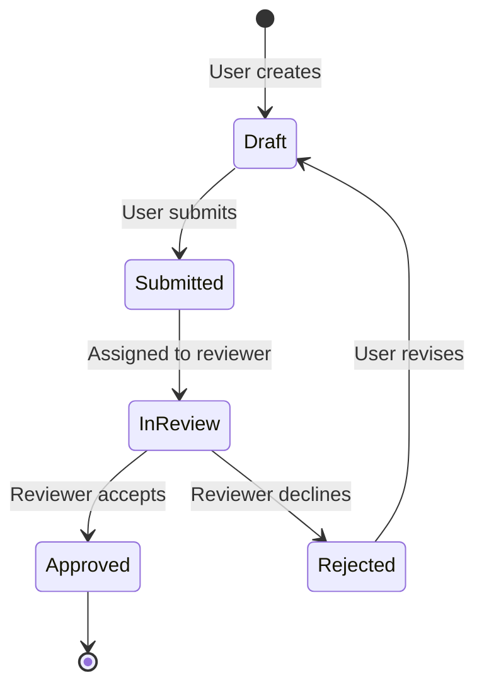

# Generate Business & User Docs from Technical Docs

Use this workflow to transform technical documentation into business-friendly and user-friendly formats.

---

## Prerequisites

- Technical documentation exists in `docs/technical/`
- Understanding of target audience (BA team, end users)

---

## 1. Identify Source Technical Documents

List available technical docs:
```bash
find docs/technical/ -name "*.md" -type f
```

Key sources for transformation:
| Technical Doc | Transforms Into |
|---------------|-----------------|
| `api-reference.md` | `data-dictionary.md`, `process-flows/` |
| `architecture/overview.md` | `process-flows/system-overview.md` |
| `core-components.md` | `data-dictionary.md` |
| `workflow.md` | `process-flows/*.md` |

---

## 2. Generate Data Dictionary

**Source:** `docs/technical/reference/core-components.md`, entity definitions

**Transform rules:**
| Technical Term | Business Term |
|----------------|---------------|
| Entity | Business Object |
| Field | Data Element |
| Association | Relationship |
| Enum | Valid Values |
| `cuid` | Unique Identifier |
| `managed` | Audit Trail (Created/Modified by) |

**Template:**
```markdown
# Data Dictionary

## [Entity Name in Plain Language]

**Purpose:** [What this represents in the business]

| Field | Description | Example |
|-------|-------------|---------|
| [fieldName] | [Plain language meaning] | [Sample value] |

**Relationships:**
- Linked to [Other Entity] via [relationship description]
```

**❌ Remove:**
- CDS syntax
- Type definitions
- Technical annotations
- Implementation details

---

## 3. Generate Process Flow Diagrams

**Source:** `docs/technical/architecture/workflow.md`, status enums

**Transform rules:**
1. Extract status values from technical docs
2. Create Mermaid state diagram
3. Add business context to transitions

**Template:**


**Add for each transition:**
- Who performs the action
- What triggers it
- What happens next

---

## 4. Generate User Guide

**Source:** `docs/technical/implementation/`, API docs

**Structure:**
```markdown
# [Feature Name] User Guide

## Overview
[1-2 sentences: What is this feature and why would I use it?]

## Getting Started
1. [First step - simple language]
2. [Second step]
3. [Third step]

## How to [Main Action]
1. Navigate to [screen name]
2. Click [button name]
3. Fill in [fields]
4. Click Submit

## What Happens Next
[Explain the outcome in business terms]

## Common Questions
**Q: [Anticipated question]**
A: [Simple answer]
```

**❌ Remove from user guides:**
- API endpoints
- Technical parameters
- Code examples
- Error codes (translate to user-friendly messages)

---

## 5. Generate Admin Guide

**Source:** `docs/technical/reference/configuration.md`, security docs

**Template:**
```markdown
# [Feature] Administration Guide

## Configuration Options

| Setting | What It Controls | Recommended Value |
|---------|------------------|-------------------|
| [setting] | [plain language] | [value] |

## User Roles

| Role | What They Can Do |
|------|------------------|
| [role] | [capabilities in plain language] |

## Troubleshooting

| Issue | Solution |
|-------|----------|
| [symptom] | [fix in plain language] |
```

---

## 6. Validation Checklist

Before publishing business/user docs:
- [ ] Zero code snippets
- [ ] Zero technical jargon
- [ ] All terms explained in plain language
- [ ] Diagrams use business terminology
- [ ] Steps are actionable by non-technical users
- [ ] Screenshots added where helpful

---

## Example Usage

```
@Documentation Manager
Generate business documentation from technical docs:

1. Read docs/technical/reference/core-components.md
2. Create docs/business/data-dictionary.md
   - Transform entities to plain language
   - Remove all CDS/code references

3. Read docs/technical/architecture/workflow.md  
4. Create docs/business/process-flows/document-processing.md
   - Create Mermaid state diagram
   - Add who/what/when for each transition

5. Read docs/technical/reference/api-reference.md
6. Create docs/product/user-manual/document-upload.md
   - Write step-by-step for end users
   - No technical terms
```
